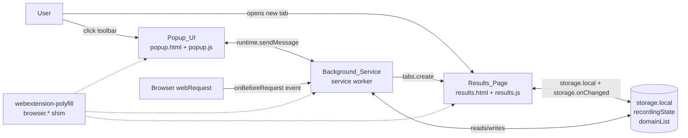
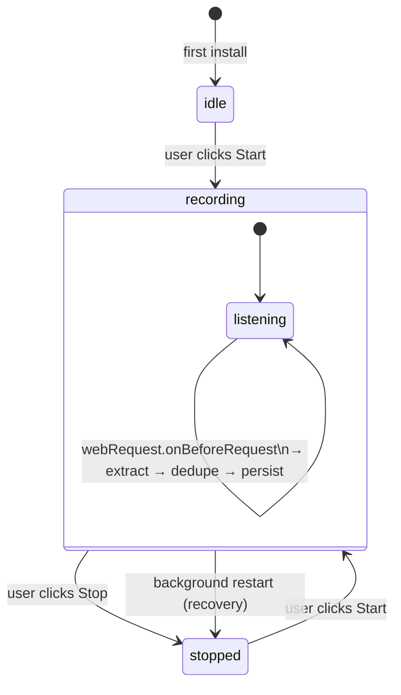

# Design Document

## Overview

The Domain Recorder Extension is a cross-browser WebExtension (Manifest V3) that observes HTTP and HTTPS requests originating from the user's tabs while a recording session is active, extracts each request's hostname using the WHATWG URL parser, normalizes it, and persists a deduplicated, capped list of domains to `storage.local`. The user controls recording from a toolbar popup and reviews the collected list on a results page opened in a new tab.

The design is shaped by four constraints from the requirements:

1. **Single codebase, two browsers.** Firefox 115+ and Chrome 120+ both support Manifest V3 and the WebExtensions APIs we need (`webRequest` in observe-only mode, `storage.local`, `tabs`, action popups). They diverge on the namespace (`browser.*` promise-based vs `chrome.*` callback-based) and on background script lifetime. We resolve this with the `webextension-polyfill` shim and by treating the background as event-driven and statelessly recoverable from `storage.local`.
2. **Privacy and minimal permissions.** No outbound network calls, no analytics, no third-party scripts. Only the permissions strictly required: `webRequest`, `storage`, `tabs`, plus `http://*/*` and `https://*/*` host permissions.
3. **Restart safety.** Chrome's MV3 service worker can be terminated and restarted at any time, and the browser itself may restart mid-session. Any persisted `recording` state must be re-interpreted as `stopped` on background startup so that we never silently keep recording across a restart.
4. **Bounded, predictable data.** The domain list is capped at 10,000 entries, normalized (lowercase, trailing-dot stripped), deduplicated, and ordered case-insensitive ascending for display and copy.

### Research Findings

- **`webextension-polyfill`**: Mozilla maintains a small shim that exposes the `browser.*` promise-based API on Chrome by wrapping `chrome.*`. This satisfies Requirement 1.3 ("compatibility shim that returns the native API implementation … without requiring code branches in calling modules"). Source: [mozilla/webextension-polyfill](https://github.com/mozilla/webextension-polyfill).
- **`webRequest` under MV3**: Chrome 120+ supports `chrome.webRequest.onBeforeRequest` in observe-only form (no `"blocking"` extra info) for unpacked and non-policy extensions; Firefox 115+ supports `browser.webRequest.onBeforeRequest` similarly. Observe-only is sufficient because we never modify or cancel requests. Sources: [Chrome `webRequest`](https://developer.chrome.com/docs/extensions/reference/api/webRequest), [MDN `webRequest.onBeforeRequest`](https://developer.mozilla.org/en-US/docs/Mozilla/Add-ons/WebExtensions/API/webRequest/onBeforeRequest).
- **Service worker vs background script**: Chrome MV3 requires a service worker; Firefox 115+ accepts both an event page and a service worker, but service worker support in MV3 is the cross-browser path. The implication: we cannot rely on in-memory state surviving across listener invocations. Every state read must come from `storage.local`, and listeners must be registered at the top level of the service worker so the browser can wake the worker for events. Source: [Chrome MV3 service workers](https://developer.chrome.com/docs/extensions/develop/concepts/service-workers).
- **`storage.local`**: Both browsers expose `storage.local` with the same shape under the polyfill. Capacity is well above what 10,000 short domain strings need (under ~1 MB worst case at 253 chars/domain). Source: [MDN `storage.local`](https://developer.mozilla.org/en-US/docs/Mozilla/Add-ons/WebExtensions/API/storage/local).
- **`storage.onChanged`**: Both browsers fire `browser.storage.onChanged` with `(changes, areaName)`. The Results_Page subscribes to this to satisfy live-refresh in Requirement 6.7 without polling.
- **WHATWG URL parser**: `new URL(observedRequest.url)` is available in service worker, popup, and page contexts on both browsers. The parser produces a punycode (ASCII) `host` for IDNs, satisfying Requirement 7.4. Source: [WHATWG URL Standard](https://url.spec.whatwg.org/).
- **Clipboard write in an extension page**: `navigator.clipboard.writeText(text)` works in extension pages opened in a tab on both browsers without additional permissions, as long as the call is in response to a user gesture. Source: [MDN `Clipboard.writeText`](https://developer.mozilla.org/en-US/docs/Web/API/Clipboard/writeText).
- **Manifest V3 action popup**: Both browsers use `manifest.action.default_popup` with `default_icon` to define the toolbar entry. Source: [MDN `action`](https://developer.mozilla.org/en-US/docs/Mozilla/Add-ons/WebExtensions/manifest.json/action).

## Architecture

### High-Level Component Diagram



### Module Layout

```
src/
  manifest.json                  # MV3 manifest, single file used for both browsers
  background/
    service-worker.js            # Entry: registers listeners, owns recording lifecycle
    recorder.js                  # Pure-ish logic: domain extraction, dedupe, cap
    storage.js                   # Wraps storage.local reads/writes with error handling
    state.js                     # Recording_State enum + transitions
  popup/
    popup.html
    popup.js                     # Renders state, count, guidance; sends start/stop
    popup.css
  results/
    results.html
    results.js                   # Renders list, handles copy/clear, listens to storage
    results.css
  shared/
    browser.js                   # Re-exports webextension-polyfill `browser` global
    domain.js                    # extractDomain(url): pure function (WHATWG URL)
    constants.js                 # Storage keys, cap, sort comparator
  vendor/
    browser-polyfill.min.js      # webextension-polyfill, MV3-friendly build
```

The `recorder.js` and `domain.js` modules are intentionally pure (no I/O, no `browser.*` calls). They are the seams where property-based testing applies. The `service-worker.js`, `popup.js`, and `results.js` modules are thin glue: they call into the pure modules and persist results via `storage.js`.

### Recording Lifecycle



Key invariants enforced by the lifecycle:

- The `webRequest.onBeforeRequest` listener is registered at the top level of `service-worker.js` so the browser can wake the worker. Inside the listener, the very first action is to read `recordingState` from `storage.local`; if it is not `recording`, the request is dropped (Requirement 3.8). This also means there is no race where a stale in-memory flag causes a request to be recorded after stop.
- On `service-worker.js` startup (cold start, install, browser restart, MV3 worker revival), a single bootstrap routine runs: load `recordingState` and `domainList` from `storage.local`, normalize missing values to defaults (`idle`, `[]`), and if the loaded `recordingState` is `recording`, transition it to `stopped` and persist (Requirement 5.6, 5.7).
- All state transitions go through a single `setState(next)` function in `state.js` that writes to `storage.local` first, then notifies the background's local cache. If the write fails, the in-memory state is not advanced (Requirement 4.6, 5.7).

### Cross-Browser Compatibility Strategy

A single shim module, `shared/browser.js`, imports `vendor/browser-polyfill.min.js` and re-exports the `browser` global. All other modules import from `shared/browser.js` and never reference `chrome.*` directly. This satisfies Requirement 1.3.

Capability detection wraps each potentially-unsupported call:

```js
async function safeApiCall(apiName, fn) {
  try {
    return await fn();
  } catch (err) {
    console.warn(
      `[domain-recorder] Unsupported or failing API: ${apiName} on ` +
        `${navigator.userAgent}. Continuing without this feature. Error: ${err}`
    );
    return undefined;
  }
}
```

This satisfies Requirements 1.4 and 1.5: the diagnostic identifies the API and the active browser, and the worker continues running.

## Components and Interfaces

### Background_Service (`background/service-worker.js`)

Responsibilities:

- Registers the `webRequest.onBeforeRequest` listener at module top level.
- Registers `runtime.onStartup`, `runtime.onInstalled`, and a `runtime.onMessage` handler at module top level.
- On bootstrap, loads state and applies the `recording → stopped` recovery rule.
- On message `START_RECORDING` / `STOP_RECORDING`, transitions state and persists.
- On `webRequest.onBeforeRequest`, reads recording state, calls `recorder.recordRequest(url, currentList)`, and persists changes.
- Updates the toolbar action badge/icon on each state change.

Public message surface (consumed by Popup_UI):

| Message           | Request payload | Response payload                                       |
| ----------------- | --------------- | ------------------------------------------------------ |
| `GET_STATUS`      | `{}`            | `{ state: 'idle' \| 'recording' \| 'stopped', count }` |
| `START_RECORDING` | `{}`            | `{ ok: boolean, state, error?: string }`               |
| `STOP_RECORDING`  | `{}`            | `{ ok: boolean, state, error?: string }`               |
| `CLEAR_DOMAINS`   | `{}`            | `{ ok: boolean, error?: string }`                      |
| `OPEN_RESULTS`    | `{}`            | `{ ok: boolean, error?: string }`                      |

### Domain extraction (`shared/domain.js`)

```ts
// Pure function. No I/O. Returns null when the URL is not eligible.
function extractDomain(rawUrl: string): string | null;
```

Algorithm:

1. Try `new URL(rawUrl)`. If it throws, return `null` (Requirement 7.7).
2. If `url.protocol` is not `"http:"` or `"https:"`, return `null` (Requirements 3.7, 7.6).
3. Read `url.hostname` (already lowercased ASCII / punycode by the WHATWG URL parser).
4. Strip a single trailing `"."` if present (Requirement 3.2).
5. If the result is empty, return `null` (Requirement 7.7).
6. Otherwise return the result (Requirement 7.1, 7.2, 7.3, 7.4).

### Recorder (`background/recorder.js`)

```ts
type DomainList = string[]; // invariant: sorted case-insensitive ascending, deduped

function recordRequest(rawUrl: string, list: DomainList): {
  list: DomainList;
  changed: boolean;
  rejected?: 'invalid' | 'not-http' | 'cap-reached' | 'duplicate';
};
```

Algorithm:

1. `domain = extractDomain(rawUrl)`. If `null`, return `{ list, changed: false, rejected: 'invalid' | 'not-http' }`.
2. If `containsCi(list, domain)`, return `{ list, changed: false, rejected: 'duplicate' }` (Requirement 8.5).
3. If `list.length >= 10_000`, log diagnostic and return `{ list, changed: false, rejected: 'cap-reached' }` (Requirement 8.6).
4. Otherwise return `{ list: insertSortedCi(list, domain), changed: true }` (Requirements 8.3, 8.4).

`containsCi` and `insertSortedCi` use `localeCompare(other, undefined, { sensitivity: 'accent' })` for ordering and a lowercase byte-equal check for membership. Because every domain in the list has already been normalized via `extractDomain` (lowercased, trailing-dot stripped), case-insensitive comparison reduces to byte equality on input that itself is lowercase. The two comparators are kept consistent.

### Storage adapter (`background/storage.js`)

```ts
async function loadState(): Promise<{ state: RecordingState; list: DomainList }>;
async function saveState(state: RecordingState): Promise<{ ok: boolean }>;
async function saveList(list: DomainList): Promise<{ ok: boolean }>;
async function clearList(): Promise<{ ok: boolean }>;
```

`loadState` applies defaults for missing keys and the `recording → stopped` recovery rule. `saveState` and `saveList` return `{ ok: false }` on failure so callers can choose not to advance in-memory state.

### Popup_UI (`popup/popup.html`, `popup.js`)

Renders one of three layouts based on state:

- **idle** or **stopped (no domains)**: title, "Start recording" button, brief description.
- **recording**: red-dot indicator, "Stop recording" button, live unique-domain count, guidance text:
  > 1. Switch to your target web application's tab.
  > 2. Sign in with your normal credentials.
  > 3. Click around and exercise the features you want covered.
  > Domains are captured automatically.
- **stopped (with domains)**: count, "Open results" button, "Start new recording" button, "Clear list" button.

The popup talks to the background only via `runtime.sendMessage`. It opens the Results_Page by sending `OPEN_RESULTS` (the background calls `browser.tabs.create({ url: browser.runtime.getURL('results/results.html') })`).

### Results_Page (`results/results.html`, `results.js`)

Layout:

- Header with title and unique-domain count.
- Toolbar: "Copy all", "Clear list".
- Main: scrollable list of domains.
- Status banner area for transient feedback ("Copied 42 domains", "Nothing to copy", "Could not load list").

Behavior:

- On load: read `domainList` from `storage.local`, sort case-insensitive ascending, render.
- Subscribe to `browser.storage.onChanged`. When the `domainList` key changes, re-read and re-render within 2 s (Requirement 6.7).
- "Copy all": calls `navigator.clipboard.writeText(list.join('\n'))`. On success, show "Copied N domains". On zero domains, show "No domains to copy" without touching the clipboard. On clipboard error, show "Copy failed" and leave the list intact.
- "Clear list": confirmation dialog → `storage.local.remove('domainList')` → re-render with count 0.

### Toolbar action / badge

- `recording`: badge text `"REC"`, badge background color `#c0392b`, icon variant with a red dot.
- `idle` / `stopped`: badge text `""`, default icon.

This is implemented in `service-worker.js` via `browser.action.setBadgeText`, `setBadgeBackgroundColor`, and `setIcon` on every state transition.

## Data Models

### Storage keys

| Key              | Type                                 | Default  | Notes                                                        |
| ---------------- | ------------------------------------ | -------- | ------------------------------------------------------------ |
| `recordingState` | `'idle' \| 'recording' \| 'stopped'` | `'idle'` | On bootstrap, `'recording'` is rewritten to `'stopped'`.     |
| `domainList`     | `string[]`                           | `[]`     | Sorted case-insensitive ascending, deduped, capped at 10000. |
| `schemaVersion`  | `number`                             | `1`      | Reserved for future migrations; current value `1`.           |

### TypeScript-style type definitions

```ts
type RecordingState = 'idle' | 'recording' | 'stopped';

interface PersistedShape {
  recordingState: RecordingState;
  domainList: string[]; // each entry: 1..253 chars, lowercase ASCII (incl. punycode), no whitespace, no trailing dot
  schemaVersion: 1;
}

interface BackgroundMessage {
  type: 'GET_STATUS' | 'START_RECORDING' | 'STOP_RECORDING' | 'CLEAR_DOMAINS' | 'OPEN_RESULTS';
}

interface BackgroundResponse {
  ok: boolean;
  state?: RecordingState;
  count?: number;
  error?: string;
}
```

### Manifest (Manifest V3)

```jsonc
{
  "manifest_version": 3,
  "name": "Domain Recorder",
  "version": "0.1.0",
  "description": "Record unique domains contacted by your web app for AWS Security Agent setup.",
  "permissions": ["webRequest", "storage", "tabs"],
  "host_permissions": ["http://*/*", "https://*/*"],
  "background": {
    "service_worker": "background/service-worker.js",
    "type": "module"
  },
  "action": {
    "default_popup": "popup/popup.html",
    "default_icon": {
      "16": "icons/icon-16.png",
      "32": "icons/icon-32.png",
      "48": "icons/icon-48.png",
      "128": "icons/icon-128.png"
    }
  },
  "icons": {
    "16": "icons/icon-16.png",
    "48": "icons/icon-48.png",
    "128": "icons/icon-128.png"
  },
  "browser_specific_settings": {
    "gecko": {
      "id": "domain-recorder@example.invalid",
      "strict_min_version": "115.0"
    }
  },
  "minimum_chrome_version": "120"
}
```

This declares exactly the permissions allowed by Requirement 10.1, no more.

## Correctness Properties

*A property is a characteristic or behavior that should hold true across all valid executions of a system — essentially, a formal statement about what the system should do. Properties serve as the bridge between human-readable specifications and machine-verifiable correctness guarantees.*

The pure modules `shared/domain.js` and `background/recorder.js`, plus the storage adapter and the rendering layer in the Popup_UI and Results_Page, expose enough universally quantified behavior to make property-based testing valuable. The properties below are derived from the prework and consolidate logically redundant requirements.

### Property 1: extractDomain correctness for http/https URLs

*For any* string built from an `http` or `https` scheme, an arbitrary case-insensitive hostname (with or without a single trailing dot, with or without an IDN component, with or without a port, path, query, or fragment), `extractDomain(url)` SHALL return the lowercased, punycode (ASCII), trailing-dot-stripped hostname containing none of the URL's port, path, query, or fragment characters.

**Validates: Requirements 3.1, 3.2, 7.1, 7.2, 7.3, 7.4**

### Property 2: extractDomain rejects ineligible URLs

*For any* string that is either (a) unparseable by the WHATWG URL constructor, (b) parseable but with an empty `hostname`, or (c) parseable with a `protocol` other than `http:` or `https:`, `extractDomain` SHALL return `null` and `recordRequest` invoked with that string SHALL leave the input list unchanged.

**Validates: Requirements 3.6, 3.7, 7.6, 7.7**

### Property 3: recordRequest size delta and uniqueness

*For any* domain list `L` (deduped, sorted, with `0 ≤ |L| ≤ 10000`) and any candidate URL `u`, applying `recordRequest(u, L)` produces a list `L'` such that:
- if `extractDomain(u)` is `null`, then `|L'| = |L|` and `L' = L`;
- if `extractDomain(u)` equals some entry in `L`, then `|L'| = |L|` and `L' = L`;
- if `extractDomain(u)` is non-null and not in `L` and `|L| = 10000`, then `|L'| = |L|` and `L' = L`;
- otherwise `|L'| = |L| + 1`, `extractDomain(u) ∈ L'`, and `L'` remains deduped, sorted case-insensitive ascending, and bounded by 10000.

**Validates: Requirements 3.3, 8.4, 8.5, 8.6**

### Property 4: Domain list invariants are preserved

*For any* sequence of `recordRequest` calls starting from an empty list, the resulting list SHALL satisfy all of the following: every entry has length between 1 and 253, every entry equals its own ASCII-trimmed lowercase form, no two entries are equal under byte equality or under trim-and-case-fold comparison, the entries are sorted in case-insensitive ascending order, and the list size does not exceed 10000.

**Validates: Requirements 7.5, 7.8, 8.1, 8.2, 8.3**

### Property 5: Capture is scoped to the recording session

*For any* interleaving of state transitions (`START`, `STOP`) and observed request URLs `u₁, u₂, …, uₙ`, the final persisted Domain_List SHALL contain exactly the deduped, sorted, capped set of `extractDomain(uᵢ)` values for which `uᵢ` arrived while the Recording_State was `recording`, and SHALL contain no domain derived from a request that arrived while the state was `idle` or `stopped`.

**Validates: Requirements 3.8, 4.5**

### Property 6: State transitions preserve the Domain_List

*For any* prior `(state, list)` pair, applying `START` or `STOP` SHALL leave the Domain_List unchanged: the resulting persisted list equals the prior list. The new state is `recording` after `START` and `stopped` after `STOP`, except when the prior state already matches, in which case the state is also unchanged.

**Validates: Requirements 2.1, 2.2, 2.3, 4.1, 4.2**

### Property 7: Storage round-trip

*For any* in-memory `(state, list)` value produced by a state transition or a successful `recordRequest`, immediately after the corresponding storage write resolves, reading `storage.local` SHALL return the same `state` value and a `list` that equals the in-memory list under the documented case-insensitive comparator.

**Validates: Requirements 3.4, 4.4, 5.2**

### Property 8: Bootstrap normalization

*For any* persisted `(state, list)` value present in `storage.local` at Background_Service startup (including the case where one or both keys are missing), the bootstrap routine SHALL produce an in-memory `state` value in `{idle, stopped}` (never `recording`) and an in-memory `list` value that is a valid Domain_List (deduped, sorted case-insensitive ascending, length ≤ 10000), and SHALL persist these normalized values back to `storage.local`. In particular, a persisted `recording` state SHALL become `stopped`.

**Validates: Requirements 5.3, 5.4, 5.6**

### Property 9: Results_Page rendering matches storage

*For any* persisted Domain_List `L`, the Results_Page SHALL render exactly `sortCi(L)` as its visible list, display `|L|` as its unique-domain count, and on user-initiated copy-all SHALL write `sortCi(L).join('\n')` to the system clipboard. After any external update to the persisted Domain_List, the rendered list, count, and clipboard payload (on the next copy-all) SHALL all be derived from the latest persisted list.

**Validates: Requirements 6.2, 6.3, 6.4, 6.5, 6.7**

### Property 10: Popup_UI count reflects storage

*For any* persisted Domain_List `L` and any persisted Recording_State `s`, when the Popup_UI is opened or already open and `storage.local` updates, the Popup_UI SHALL display `|L|` as the unique-domain count and SHALL display the state `s` (mapped to its visible UI affordances).

**Validates: Requirements 5.8, 9.2**

## Error Handling

The extension treats most failures as recoverable and prefers to leave the user's data intact over advancing state on a partial write.

### Storage write failures

`saveState`, `saveList`, and `clearList` in `storage.js` resolve to `{ ok: boolean, error?: Error }` rather than throwing. Callers in the background, popup, and results pages branch on `ok`:

- On `START`/`STOP` transitions, if `saveState` returns `{ ok: false }`, the in-memory state is not advanced, the listener registration that the transition would have performed is rolled back (or, on `STOP` failure, the listener stays registered), and a diagnostic is logged. The user can retry by clicking the control again. (Requirements 2.6, 4.6.)
- On a domain-add path, if `saveList` returns `{ ok: false }`, the in-memory list keeps the old value (the addition is dropped), and a diagnostic is logged. The next request that produces a new domain will retry the write. (Requirement 3.5.)

### Storage read failures

On Background_Service bootstrap, if `storage.local.get` throws or rejects, both keys are initialized to defaults in memory and a diagnostic identifies which key failed. The defaults are then written back so subsequent reads succeed (Requirement 5.5). The Popup_UI and Results_Page treat read failures as a UI condition: they show an error indication and render with `state = 'idle'` and `count = 0` / empty list (Requirements 5.9, 6.8).

### webRequest listener registration failure

`browser.webRequest.onBeforeRequest.addListener(...)` is wrapped in a try/catch. On failure, the state is rolled back to its prior value via `setState(prior)`, the diagnostic logs the API name and the error, and the popup's next `GET_STATUS` reflects the rollback so the UI does not falsely indicate recording (Requirement 2.6).

### Browser/service-worker restart while recording

Handled by the bootstrap normalization property: any persisted `recording` is rewritten to `stopped` on startup. If the rewrite write itself fails, the in-memory value remains `recording` and a diagnostic is logged; on the next event-driven wake-up the bootstrap retries. The user-visible effect of a successful recovery is that the toolbar shows the `stopped` state with the captured list intact (Requirements 5.6, 5.7).

### Domain list cap

When `|list| = 10000` and a new candidate would otherwise be added, `recordRequest` rejects the addition (Requirement 8.6), logs a single diagnostic the first time the cap is reached during a session (to avoid log flooding), and returns `{ rejected: 'cap-reached' }`. The list and storage are unchanged.

### Clipboard write failure

The Results_Page wraps `navigator.clipboard.writeText(text)` in a try/catch. On rejection, a status banner shows "Could not copy domains to clipboard" and the Domain_List in storage is untouched (Requirement 6.10). On an empty list, the page short-circuits before calling the clipboard API and shows "No domains to copy" (Requirement 6.9).

### Unsupported API

The `safeApiCall(apiName, fn)` helper logs a diagnostic identifying `apiName` and the active browser (`navigator.userAgent`) and returns `undefined`. Callers that depend on an optional API check for `undefined` and continue without that feature (Requirements 1.4, 1.5).

### Diagnostic logging convention

All diagnostics are written via `console.warn` (recoverable) or `console.error` (data loss possible) and prefixed with `[domain-recorder]` so they are easy to filter in the extension console. No diagnostics are sent off-device (Requirement 10.3).

## Testing Strategy

### Toolchain

- **Unit + property runner**: [Vitest](https://vitest.dev/) for the test runner with [fast-check](https://github.com/dubzzz/fast-check) integrated via `fast-check`'s native Vitest helpers. Both run in Node and a `jsdom` environment for DOM tests.
- **Cross-browser load tests**: a small CI script that loads the unpacked extension in headless Firefox 115 and headless Chrome 120 (via `web-ext` and `puppeteer` respectively) and asserts the background reports `ready` within 5 s and no console errors.
- **DOM rendering**: jsdom + small hand-written renderers; we deliberately avoid a UI framework so the popup and results pages are easy to test without a heavy harness.
- **Mocks**: a hand-rolled `mockBrowser` that exposes `storage.local`, `storage.onChanged`, `webRequest.onBeforeRequest`, `tabs.create`, `runtime.sendMessage`, and `action.setBadgeText/setIcon`. Tests inject this mock by replacing the `shared/browser.js` import.

### Property tests

Each correctness property maps to exactly one property-based test, configured to run a minimum of 100 iterations. Each test is tagged with a comment of the form:

```js
// Feature: domain-recorder-extension, Property 1: extractDomain correctness for http/https URLs
```

| Property | File                                  | Generators                                                                                                                  |
| -------- | ------------------------------------- | --------------------------------------------------------------------------------------------------------------------------- |
| 1        | `tests/property/domain.spec.js`       | URL parts: scheme ∈ {http, https}, host (mixed case ASCII, IDN samples, optional trailing dot), port, path, query, fragment |
| 2        | `tests/property/domain.spec.js`       | URL strings: scheme ∈ {ftp, file, ws, mailto, javascript, data, about, chrome}, malformed URLs, empty-host URLs             |
| 3        | `tests/property/recorder.spec.js`     | Sorted-deduped lists of normalized domains (size 0..10000), candidate URLs                                                  |
| 4        | `tests/property/recorder.spec.js`     | Sequences of arbitrary candidate URLs applied via `recordRequest`                                                           |
| 5        | `tests/property/session.spec.js`      | Sequences of `{ kind: 'start'                                                                                               | 'stop' | 'request', payload }` events |
| 6        | `tests/property/state.spec.js`        | `(state, list)` pairs and a transition kind                                                                                 |
| 7        | `tests/property/storage.spec.js`      | Random `(state, list)` pairs written via the adapter, read back                                                             |
| 8        | `tests/property/bootstrap.spec.js`    | Persisted-storage shapes including missing keys, `recording`, malformed list values                                         |
| 9        | `tests/property/results-page.spec.js` | Random Domain_Lists rendered into jsdom; storage update sequences                                                           |
| 10       | `tests/property/popup.spec.js`        | Random `(state, list)` pairs rendered into jsdom; storage update sequences                                                  |

### Example and edge-case tests

The prework identified several requirements better tested with examples than with property generators. These live in `tests/example/` and run in the same Vitest suite:

- Diagnostic logging on `safeApiCall` failure (Req 1.4) — `tests/example/api-shim.spec.js`.
- Continuation after `safeApiCall` failure (Req 1.5) — same file.
- Listener registration failure rolls back state and logs (Req 2.6) — `tests/example/transitions.spec.js`.
- `STOP` removeListener call (Req 4.3) — same file.
- Persistence failure on stop retains state (Req 4.6) — same file.
- Storage read failure on bootstrap (Req 5.5) — `tests/example/bootstrap.spec.js`.
- Bootstrap rewrite write failure retains `recording` (Req 5.7) — same file.
- Popup storage read failure (Req 5.9) — `tests/example/popup.spec.js`.
- Open-results control invokes `tabs.create` with the results URL (Req 6.1) — `tests/example/popup.spec.js`.
- Results retrieval failure (Req 6.8) — `tests/example/results-page.spec.js`.
- Copy-all on empty list (Req 6.9) — same file.
- Clipboard write rejection (Req 6.10) — same file.
- Guidance text and stop-control rendering (Reqs 2.7, 2.8, 9.1, 9.3) — `tests/example/popup.spec.js`.
- Badge/icon transitions (Reqs 2.9, 4.8) — `tests/example/badge.spec.js`.

### Smoke and integration tests

Some requirements are about static contracts (manifest contents, no banned APIs, no third-party scripts) or about the extension loading in real browsers. These are covered in `tests/smoke/`:

- `manifest.spec.js`: parses `src/manifest.json` and asserts `permissions === ['webRequest', 'storage', 'tabs']` and `host_permissions === ['http://*/*', 'https://*/*']` exactly (Req 10.1).
- `static-contracts.spec.js`: greps the source tree to assert no `chrome.` references outside `shared/browser.js` (Req 1.3), no `storage.sync|.session|.managed` (Reqs 5.1, 10.2), no `fetch|XMLHttpRequest|sendBeacon|new WebSocket\(` in extension source (Req 10.3), no third-party SDK imports and no `<script src="http">` in popup/results HTML (Req 10.4).
- `cross-browser.spec.js` (in CI): launches Firefox 115 and Chrome 120 with the unpacked extension, asserts manifest parses without errors and the background reports `ready` within 5 s (Req 1.2).
- `egress.spec.js` (in CI): runs a recording session with a network mock that fails any outbound request from the extension's origin; asserts no such request occurred (Req 10.3).
- Manual checklist for uninstall data-clearing on both browsers (Req 10.5).

### Coverage and balance

Property tests cover the seams (pure functions, state transitions, storage round-trip, rendering derivations). Example tests cover error paths and the small set of UI affordances that are easier to assert directly. Smoke and integration tests cover the manifest, the cross-browser load, and the privacy contract. Together they exercise every acceptance criterion at least once, with the explicit mapping shown in the property and example tables above.
