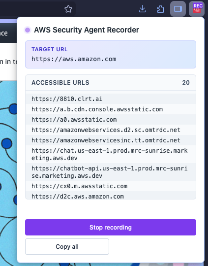
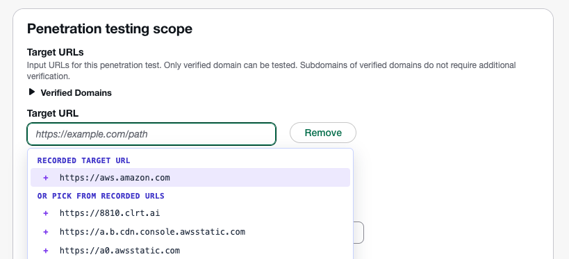

# AWS Security Agent Recorder

A cross-browser extension that records the unique domains your web app
contacts and auto fills them in the [AWS Security Agent](https://aws.amazon.com/security-agent/) pentest configuration.



## What it does

When you start a recording session in the active tab:

1. The extension captures the tab's origin as the **target URL**.
2. It reloads the tab and watches every HTTP request it makes.
3. Every other unique origin the page contacts is added to a list of
   **accessible URLs**.
4. A pastel purple/blue border around the page reminds you a session is
   active.
5. On AWS Security Agent's "create" pages, focusing a Target URL,
   Accessible URLs, or Out-of-scope URLs field shows a panel with the
   recorded values. Click one to fill the field. Filled entries get a
   green check, excluded entries get a red x.

The popup shows the target URL, the running list of accessible URLs, and
buttons to Start, Stop, Copy all, and Clear.

All data lives in `storage.local` and never leaves your browser.

## Install

In the artifacts folder, download the zip that matches your browser.

- `aws-security-agent-recorder-chrome-X.Y.Z.zip`
- `aws-security-agent-recorder-firefox-X.Y.Z.zip`

### Chrome (unpacked, persistent)

1. Unzip the Chrome zip somewhere stable (the folder must remain in
   place for as long as you use the extension).
2. Open `chrome://extensions`.
3. Toggle **Developer mode** on (top right).
4. Choose **Load unpacked** and pick the unzipped folder (the one that
   contains `manifest.json`).
5. Pin the extension from the puzzle-piece menu in the toolbar so the
   icon is visible.

The extension stays installed across browser restarts. Updating means
replacing the folder contents with a newer release and clicking the
refresh icon on the extension's card in `chrome://extensions`.

### Firefox (temporary install)

Firefox will load the extension as a **temporary** add-on
that is removed when you close Firefox.

1. Open `about:debugging#/runtime/this-firefox`.
2. Choose **Load Temporary Add-on...**.
3. In the file picker, select the Firefox **zip itself**, or unzip it
   first and pick the `manifest.json` inside the unzipped folder.
4. The extension appears under **Temporary Extensions** and the toolbar
   icon shows up immediately.

You'll need to repeat these steps after each Firefox restart.

## Use

To use the extension, follow the steps below.

1. Open the page you want to record.
2. Choose the extension icon to open the popup.
3. Choose **Start recording**. The page reloads and a pastel border
   appears around it.
4. Use the app normally: navigate, log in, exercise the features you
   want covered. Each new origin shows up in the popup list.
5. Choose **Stop recording** when you're done. The border disappears.
6. Follow the steps on [Create a penetration test](https://docs.aws.amazon.com/securityagent/latest/userguide/perform-penetration-test.html). Focus the Target URL field
   and pick the recorded value from the panel; do the same for
   Accessible URLs and Out-of-scope URLs.

>Note: You may want to include an accessible URL as another target. This is common for applications where the API is served from a different domain than the target.

7. If you'd rather paste manually, choose the domain in the popup to copy to your clipboard.



## Remove

### Chrome

1. Open `chrome://extensions`.
2. Find **AWS Security Agent Recorder**.
3. Click **Remove**, then confirm.
4. Delete the unpacked folder you loaded earlier if you no longer need it.

### Firefox

Temporary add-ons are removed automatically when Firefox closes. To
remove one mid-session:

1. Open `about:debugging#/runtime/this-firefox`.
2. Find **AWS Security Agent Recorder** under "Temporary Extensions".
3. Click **Remove**.

Either path also clears the extension's `storage.local` data.

## Build from source

If you'd rather build the zips yourself instead of downloading them:

```
npm install
npm run package
```

The script produces `dist/chrome/` and `dist/firefox/` (loadable as
unpacked extensions) plus matching zip files in `dist/`.
